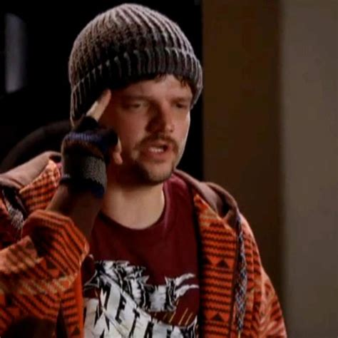
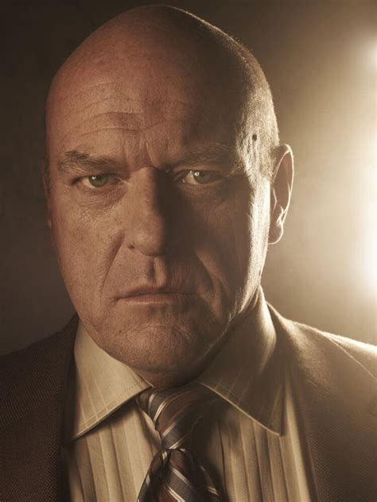
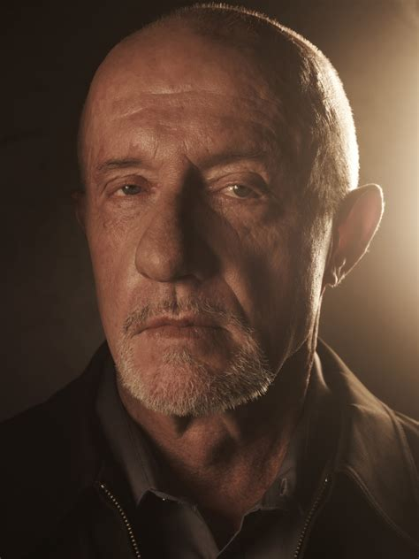
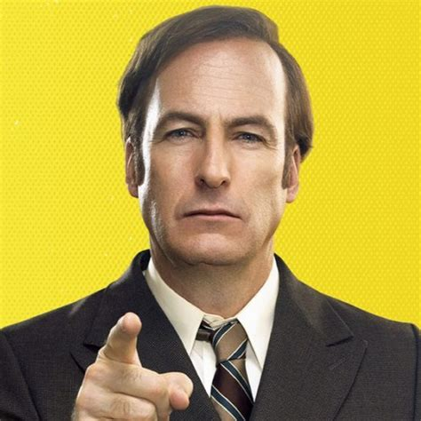
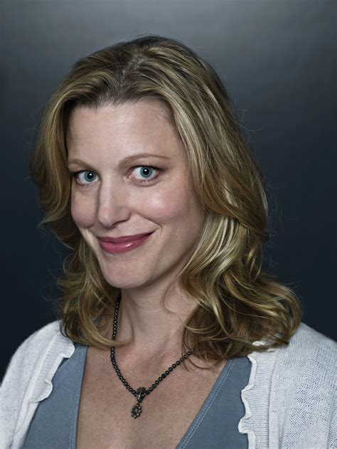
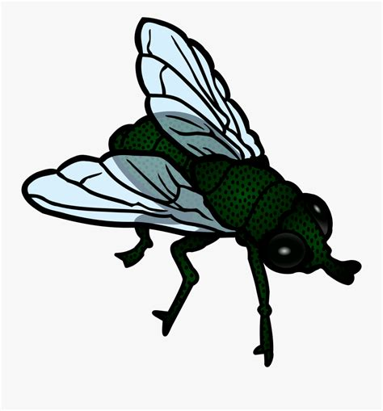

# Projeto com a API de frases de BreakingBad.

## HTML:
```
    <!DOCTYPE html>
<html lang="pt-BR">
<head>
    <meta charset="UTF-8">
    <meta name="viewport" content="width=device-width, initial-scale=1.0">
    <title>Orientação a Objetos</title>
    <link rel="stylesheet" href="css/style.css">
</head>
<body>

    <div class="title-home"><h1>Breaking Bed</h1></div><!--title-home-->
    <div class="container">
</div><!--container-->

</body>
</html>
<script src="https://cdnjs.cloudflare.com/ajax/libs/animejs/3.2.2/anime.min.js"></script>
<script src="js/scripr.js"></script>
```
## JS:
```
    (()=>{
    {//
        var interval = 5000
       setInterval(()=>{ 
        let api = `https://api.breakingbadquotes.xyz/v1/quotes/100000`
            fetch(api).then(res => res.json()).then(respObj => {
                var obj = document.querySelector('div.container')
                anime({
                    targets: obj,
                    opacity: [0, 1],
                    translateY: [20, 0],
                    easing: 'easeInOutQuad',
                    duration: 2000,
                })
                for(var i = 0;i < respObj.length;i++){
                    var author = respObj[i].author
                    var quotes = respObj[i].quote
                   if(author == 'Badger'){
                        obj.innerHTML = `
                        <div class="mess">
                        <div class="img-profile"></div><!--img-profile-->
                        <h3>${author}</h3>
                        <p>${quotes}</p>
                        </div><!--mess-->
                        `
                    }else if(author == 'Gustavo Fring'){
                        obj.innerHTML = `
                        <div class="mess">
                        <div class="img-profile"></div><!--img-profile-->
                        <h3>${author}</h3>
                        <p>${quotes}</p>
                        </div><!--mess-->
                        `
                    }else if(author == 'Hank Schrader'){
                        obj.innerHTML = `
                        <div class="mess">
                        <div class="img-profile"></div><!--img-profile-->
                        <h3>${author}</h3>
                        <p>${quotes}</p>
                        </div><!--mess-->
                        `
                    }else if(author == 'Jesse Pinkman'){
                        obj.innerHTML = `
                        <div class="mess">
                        <div class="img-profile"></div><!--img-profile-->
                        <h3>${author}</h3>
                        <p>${quotes}</p>
                        </div><!--mess-->
                        `
                    }else if(author == 'Mike Ehrmantraut'){
                        obj.innerHTML = `
                        <div class="mess">
                        <div class="img-profile"></div><!--img-profile-->
                        <h3>${author}</h3>
                        <p>${quotes}</p>
                        </div><!--mess-->
                        `
                    }else if(author == 'Saul Goodman'){
                        obj.innerHTML = `
                        <div class="mess">
                        <div class="img-profile"></div><!--img-profile-->
                        <h3>${author}</h3>
                        <p>${quotes}</p>
                        </div><!--mess-->
                        `
                    }else if(author == 'Skyler White'){
                        obj.innerHTML = `
                        <div class="mess">
                        <div class="img-profile"></div><!--img-profile-->
                        <h3>${author}</h3>
                        <p>${quotes}</p>
                        </div><!--mess-->
                        `
                    }else if(author == 'The fly'){
                        obj.innerHTML = `
                        <div class="mess">
                        <div class="img-profile"></div><!--img-profile-->
                        <h3>${author}</h3>
                        <p>${quotes}</p>
                        </div><!--mess-->
                        `
                    }else if(author == 'Tuco Salamanca'){
                        obj.innerHTML = `
                        <div class="mess">
                        <div class="img-profile"></div><!--img-profile-->
                        <h3>${author}</h3>
                        <p>${quotes}</p>
                        </div><!--mess-->
                        `
                    }else if(author == 'Walter White'){
                        obj.innerHTML = `
                        <div class="mess">
                        <div class="img-profile"></div><!--img-profile-->
                        <h3>${author}</h3>
                        <p>${quotes}</p>
                        </div><!--mess-->
                        `
                    }
                }
            }).catch(error => {
                console.log(error)
            })
        },interval)

        console.log('By DevSozinho')
    }//
})();
```
## CSS:
```
    *{
    padding: 0;
    margin: 0;
    font-family: Verdana, Geneva, Tahoma, sans-serif;
    font-weight: normal;
    color: #555555;
    box-sizing: border-box;
    resize: none;
    scroll-behavior: smooth;
}
html,body{
    height: 100%;
    background-color: #0f0f11;
}
/*-*/
div.title-home{
    max-width: 800px;
    height: 15%;
    margin: 0 auto;
    display: flex;
    align-items: center;
    justify-content: center;
    background-color: #121213;
}
div.title-home h1{
    font-size: 3em;
}
div.mess{
    max-width: 400px;
    margin: 70px auto;
    padding: 20px;
    border-radius: 8px;
    text-align: center;
    background-color: #343541;
}
div.mess img{
    max-width: 200px;
    max-height: 200px;
    border-radius: 8px;
    margin-bottom: 15px;
}
div.mess h3{
    font-size: 2em;
    color: #CCCCCC;
    margin-bottom: 8px;
}
div.mess p{
    color: #545454;
    margin-bottom: 25px;
}
div.mess button{
    max-width: 160px;
    min-width: 150px;
    line-height: 30px;
    cursor: pointer;
    border-bottom: 5px solid #0d685f;
    border-top: none;
    border-left: none;
    border-right: none;
    background-color: #26a69a;
    color: #FFFFFF;
    font-size: 1.5em;
    border-radius: calc(150px / 2);
}
```